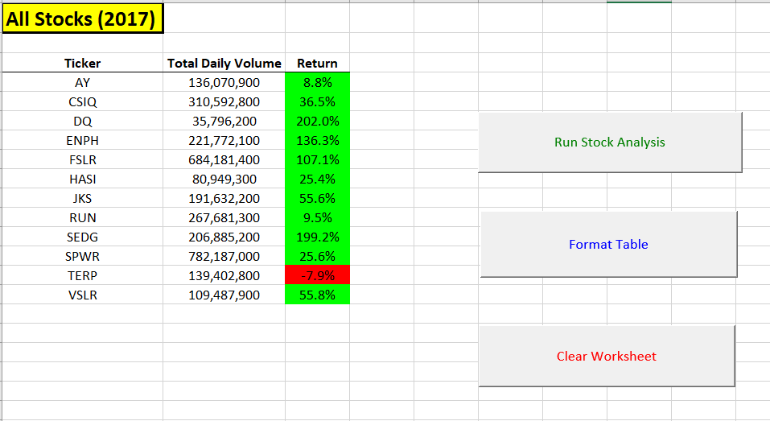
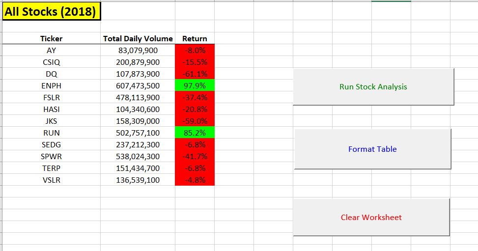
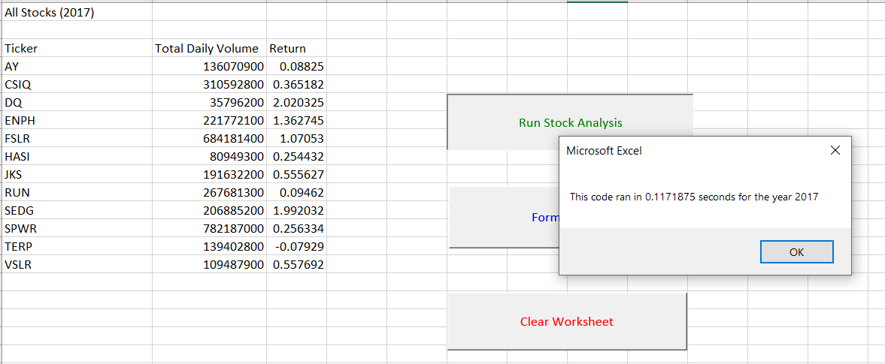
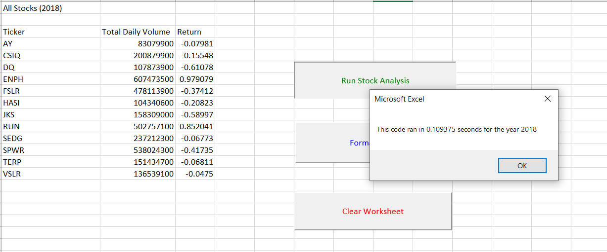

# Stock Analysis Report For Steve

## *Section I: Project Overview*

Steve is a recent finance graduate who is helping his parents out with their investment needs. Steve hired SATC Consulting to help build an Excel workbook to perform his analysis. He requested that we focus on twelve stocks within the green energy space. We performed a separate analysis on Dacqo (“DQ”) since his parents were very interested in investing in that stock. For more on DQ, please see the “DQ Analysis” worksheet in the “VBA-Challenge” workbook. We analyzed the performance data of all twelve green stocks from the years 2017 – 2018, which are represented in separate worksheets. The main types of data we were focused on were the daily opening and closing prices of each stock for each month of the year. This information was used to calculate the annual return information for each year for a particular stock. In addition, we tracked daily volume for each stock in order to understand how actively traded the investment was throughout the year and therefore, how reliable the pricing information was for that stock. 

We used macros to perform our stock analysis. To see the results, please go to the “All Stock Analysis” worksheet. There are three buttons that the user can click on to perform the analysis: “Run Stock Analysis”, “Format Table”, and “Clear Worksheet”. We recommend that the user click on the “Run Stock Analysis” button first where he will be prompted to enter a year (either 2017 or 2018). Enter whichever year of interest, then hit the “Format Table” button to format the table and once done analyzing the stocks, then hit the “Clear Worksheet” button to clear the contents. After everything is clear, then hit the “Run Stock Analysis” but enter the other year that you did not perform your previous analysis on and repeat the latter steps. 

## *Section II: Results*

### *Sub-Section A: Green Stock Performances*

The results of our analysis our presented in Figures 1-1 and 1-2. At first glance, you can see that there is a significant change in the performances of a majority of the twelve stocks from 2017 – 2018. In 2017, eleven of the twelve stocks experienced gains for the year, with a majority exhibiting significant increases from the prior year (Figure 1-1). For 2018, the story is much different. Stocks for this period declined considerably for that year. With some preliminary research1, we found that 2018 was a down year for the stock market overall due to investor concerns over Brexit (Great Britain’s exit from the European Union) and weakness in the Chinese economy. As a result, we can see that the stock market’s overall performance had a significant effect on many of the green stocks within our sample. 

Still, the market’s performance does not fully explain wide range of performance within each period. For instance, even though both stocks DQ and RUN experienced gains in 2017, the former increased much greater than the later. Without having more information on the investments themselves, their respective industries within the green economy, and without reviewing their financial statements, it is hard to ascertain potential reasons for the discrepancy in their performances. And this goes for all of the other stocks within our twelve-stock sample. 

SATC Consulting highly recommends to Steve that in addition to the information that we provided, that he takes time to further research these twelve specific companies and focus more on their fundamentals (a stock market term that refers to other types of investment data such as financial performance, underlying economics, business model, industry focus, etc.) rather than their technical indicators (another stock term to refer to pricing and volume information alone). If Steve makes his recommendations without engaging in such research, then he will be doing a serious disservice to his parents. He would be making highly uninformed decisions that could potentially hurt his parents’ portfolio. 

**Figure 1-1**

**Figure 1-2**

### *Subsection B: Technical Recommendations With VBA*

This section discusses the technical tools that we used to perform the analysis, specifically Visual Basic Code in Microsoft Excel or also known as VBA. We write this section to provide Steve with insights on how he can use VBA to perform his own analysis and use similar algorithms that we developed to expand his research. Before we get into the code, let us discuss the workbook that we used to perform the analysis and provide some clarity as to its organization and how we came up with our results. In the excel workbook titled VBA-Challenge.xlsm, we have six tabs. A couple of tabs that are of interest to us are the two tabs titled “2017” and “2018”. These contain over 3,000 daily records of stock pricing and volume performances (technical indicators) for each year for all twelve green stocks. These data points were then summarized in two separate worksheets titled “Original Code” and “All Stock Analysis”.

Within these two worksheets, there are three buttons to perform the analysis on the data. All three buttons perform the same type of actions for each worksheet: the button at the top runs the analysis; the middle button formats the table; and the bottom button clears the worksheet. The titles for the button are different for each worksheet to account for the different types of code that backs them up (mainly the codes for the buttons that run the stock analysis). We will go over the code for each of these buttons in more detail in later sections. 

However, we created two worksheets with separate codes to show the positive effects of coding efficiently. We measure these benefits by tracking the differences in performance by each worksheet when we run the stock analysis. Before we show these differences, let us look at the output of the two worksheets for each of the years for 2017 and 2018, which are provided in Figures 1-3 and 1-4. Each figure has two pictures of the results for each worksheet. The pictures on the top with the title on the upper-left corner highlighted in yellow and bolded represent the improved or refactored code while the pictures on the bottom represent the original code (no highlighted titled that is not bolded as well).  

Notice anything interesting? They both produce the same results for the analysis. If both codes produce the same type of analysis, then why bother refactoring the code? What was improved? To answer this question, we analyze the timing differences for running each type of code.

**Figure 1-3**

**Figure 1-4**

The following pictures in Figures 1-5 and 1-6 compare the length of time the code ran for each year. Figure 1-5 represents the times results for 2017 while Figure 1-6 represents the same type of information for 2018. The top picture within each figure represents the VBA code from the worksheet “Original Code” while the bottom represents that from “All Stocks Analysis” worksheet. The reader is encouraged to review both Figures in order to understand the performance differences between the original code (results are represented in “Original Code” worksheet) and then its refactored version (results represented in “All Stocks Analysis” worksheet).

**Figure 1-5**

**Figure 1-6**

For each year, the original code ran for about 25 – 26 seconds which is far slower than the refactored code’s time for those same periods, which was about 1/10th of one second. The performance differences between the original code and its refactored version show the important of going back and editing and making code more efficient. When time is of the essence, such stark contrasts in the speed (and probably the usage of memory) between the two codes can make a difference in the timing of information, which would affect Steve’s stock analysis. One thing the reader will see once he clears the contents and runs the original code is that not only is slower but it freezes Excel, which suggests that it might be using too much memory. This introduces another benefit of refactoring code in that when you find ways to make it more efficient, you can shorten it and utilize less storage space within the application. 

Next, we will review the VBA scripts for both the original code and refactored code and try to identify reasons for the performance differences. We also want to illustrate generally how each script is running the analysis. Please review Figures 1-7 and 1-8, which follow this paragraph. Figure 1-7 shows the VBA script for the original code while Figure 1-8 shows the VBA script for the refactored algorithm.

**Figure 1-7**

**Figure 1-8**

Both Figures 1-7 and 1-8 have comments within the VBA script so we will leave it to the reader to review each document in order to understand step-by-step what each block of code does. Plus, the reader has access to the original Excel file and can review the code from there. We will discuss now in general what each script does when run by the user. 

The similarities between the original code in Figure 1-7 and the refractored code in Figure 1-8 is that both utilize arrays to capture all the ticker values within the data (all twelve that is). They also utilize ticker arrays to guide other parts of the code to assign certain values (for instance one starting price for each ticker) for each stock in the summary sheets. 

The difference between the original and refactored codes is that the former manually enters in the specific indices within its ticker array while the later has Excel dynamically enter indices within its ticker array through a variable called tickerIndex. While both generate the same output, the refactored code provides more flexibility when Steve wants to include or remove stocks from his dataset. In other words, he does not have to keep manually enter tickers within the array, which would take up a lot of time and might create opportunities for errors. The more you can automate certain tasks, the less likely mistakes will be made. 

Moreover, the original code created three variables to find the total volume, starting price, and ending price of each ticker for the year. The refactored code however, created separate arrays for each of these data points. This was so that the tickerIndex variable could be used to fill indices within each of these arrays whenever blocks of code were being executed and then call up the values of certain indices for whatever ticker we were analyzing. 

For instance, the first instance of the stock CSIQ in the “2018” worksheet is row 253. According to the refactored code, because this is point where the ticker values within column A change (from AY to CSIQ), tickerIndex increases from 0 to 1, which means the ticker(tickerIndex) for CSIQ is ticker(1). The other arrays totalVolume(tickerIndex) and startingPrice(tickerIndex) will have the tickerIndex variable that assigns values to their arrays increase by 1 as well. So totalVolume(tickerIndex) for CSIQ is tickerVolume(1) which represents the summation of all the daily volumes for CSIQ. Likewise, the first row for CSIQ, which is 253, has an opening price of 16.98. This gets stored as startingPrice(1) which refers to the opening price for that ticker in the startingPrice array. The endingPrice array works differently. Instead of the endingPrice(tickerIndex) for CISQ being represented as endingPrice(1), it is actually represented by endingPrice(2). This is due to tickerIndex increasing from 1 to 2 is when the endingPrice array captures the closing price for CSIQ, which is within its last row. 

As a result of the dynamic interplay within the four arrays and the variable tickerIndex, the refactored code is much shorter and is capable of running more efficiently. Also, when the user executes the code, he will notice that the refactored version does not slow down Excel as it does not utilize much memory (so we assume). 

Finally, we wanted to make one more point about the code. If you look at the way starting prices are calculated for each code, you will see that we reference column C, the opening prices, instead of referencing again Column F, closing prices (which is also used to calculate ending prices for those same tickers). The reason we used opening prices is because they more accurately reflect the starting prices for each ticker and therefore, are more appropriate for calculating the stock’s return. 

You will notice that the previous day’s closing prices for all tickers does not equal the next day’s opening prices. There is an economic reason for this phenomenon. We did some research and found that even when markets are closed, there are some intraday trades that are entered into for stocks2. The implications for such activity is that when the market opens the following day, the stocks prices will be different from the previous day’s close. Since we had to choose either using the first opening day price or the first day’s closing price as the starting price, we chose the former because that is the price of the stock right when it opens and therefore it captures additional (not much) trading activity for that stock which should (just to be accurate) included in the stock’s return calculations. 

We understand that this goes against conventional logic when performing stock analysis (at least for Module 2) and are willing to accept such criticisms for going in a different direction. SATC Consulting is opened to discussing with others the basis for all of its decisions and recommendations. 

## *Section III: Summary*

We created Excel-based algorithms for Steve to calculate annual trading volumes and returns for a select group of green stocks that he was interested in evaluating as potential investments for his parents. Indeed, we updated the code in the refactored version to be able to include analysis for not just the stocks that were evaluated, but for other stocks (green energy or for any other sector for that matter) that Steve may be interested in reviewing as well. Note that the logic used to create these two algorithms (the original and refactored codes) can be expanded and used to calculate other types of key information for stocks (total revenues for example) that would be helpful in Steve’s analysis. So for instance there might be a totalRevenue, P-E-Ratio, and EPS arrays used to provide fundamental information in addition to the previous technical indicators that Steve used to analyze stocks. 

We advise Steve to refrain from making any investment recommendations to his parents AT THIS POINT. He needs more than two years of pricing and volume information to make an adequate investment recommendation for his parents. Just look how volatile prices for these twelve stocks were from 2017 to 2018. If he makes a mistake in his recommendation, his parents portfolio could suffer greatly in terms of lost value. As a result, he needs to increase the amount of time reviewed for these green stocks from two years to either seven or more in order to gain a solid understanding of the pricing behavior of these investments. 

We recommend that Steve broaden the data types that he is looking for within his sample of stocks and not just include technical indicators but fundamental ones (like revenue, profits, P/E ratio, assets, business model, industry outlook, etc.) as well. Doing so will provide him with a better understanding as to the potential performance of each of these investments and therefore increase his chances of picking a stock that will do well in the future. 

Finally, we wanted to reiterate the advantages and disadvantages of refactoring code in general. The advantage was demonstrated in the codes that we provided: efficiencies can be created when code is refactored and performance can be improved as well. The disadvantage is that refactoring the code takes time that one may not have. After all, you there are times where one has to completely rethink the design of the code in order to make it more dynamic. For instance, it took us one day to create the original code, but five days to create the refactored. This does not suggest that refactoring always takes up a lot of time, but that it can on certain occasions. 

In addition to there being advantages and disadvantages with refactoring in general, there are pros and cons with the original and refactored codes that we created for Steve. The positives for the original code was again, it was easy to devise and run. The negatives were that it was very inefficient when executed and not as dynamic, which could pose problems when Steve wants to include more stocks or less. The benefits of the refactored code that we provided were that performance of running the code and doing the analysis was improved. In addition, it was simpler and automated more parts of the analysis, which reduces the potential for error. The negatives were that it introduced functions that Steve might not be too familiar with and that it took a long time to devise. 
This is the end of our report. We encourage Steve or any other consumer of this report to reach out to us for any questions that he or she may have. 
 
### Works Cited

1.	Isidore, Chris. “2018 Was The Worst For Stocks In 10 Years”. CNN Business, https://www.cnn.com/2018/12/31/investing/dow-stock-market-today/index.html. Accessed 9 November 2021.

2.	Merrittt, Cam. “Why Is Open Sttock Price Different Than Closed Stock Price?” ZACKS Finance, https://finance.zacks.com/open-stock-price-different-closed-stock-price-6656.html. Accessed 9 November 2021.
